# Architecture - Doucement

Ce document décrit l'architecture technique de Doucement avec des diagrammes Mermaid.

---

## Vue d'ensemble

Doucement est une **SPA 100% statique** (Single Page Application) sans backend. Toutes les données sont stockées localement dans le navigateur.

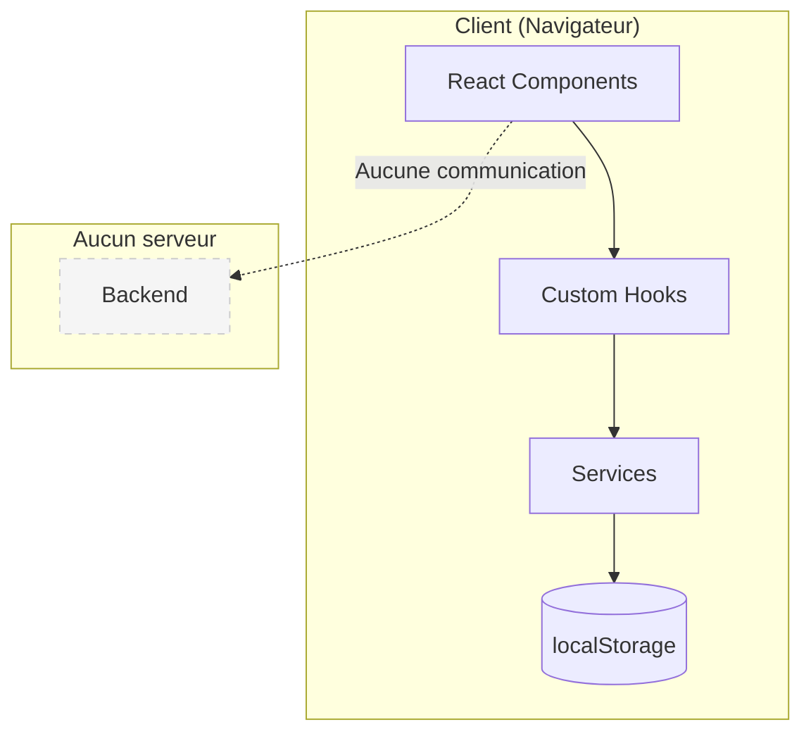

---

## Flux de données

### Lecture des données

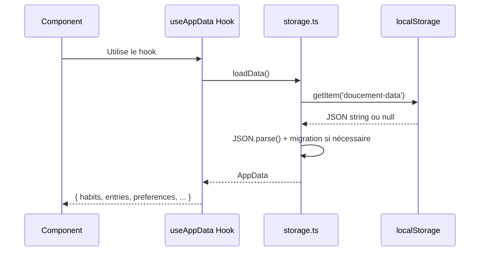

### Écriture des données

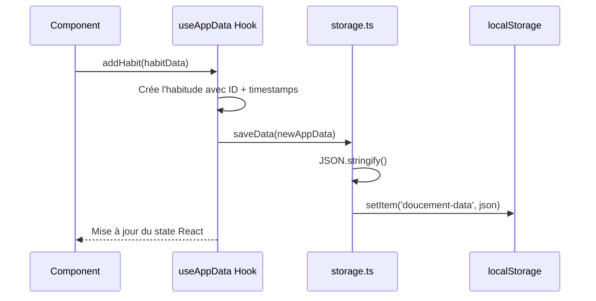

---

## Cycle de vie d'une habitude

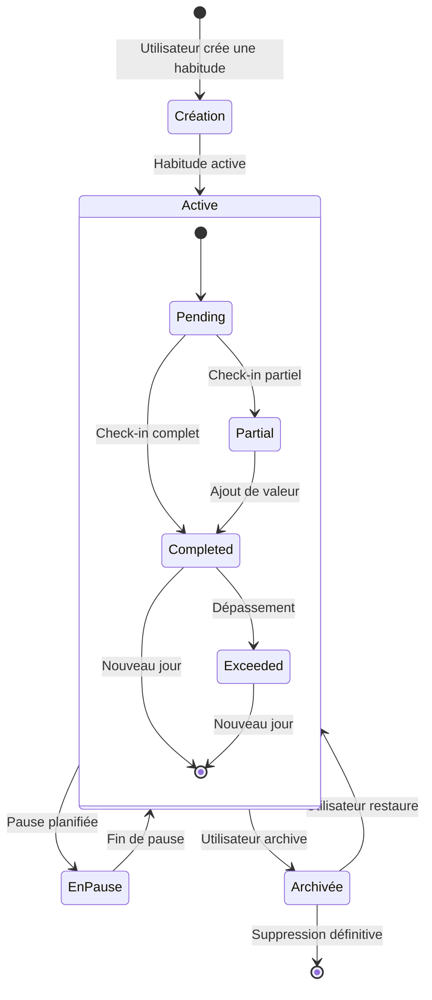

---

## Structure des services

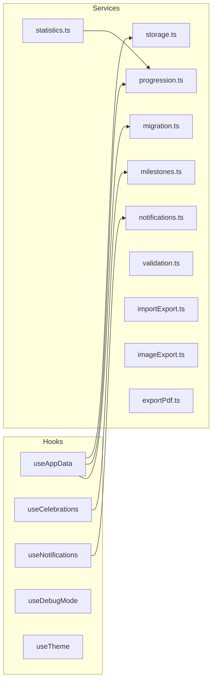

### Responsabilités des services

| Service | Responsabilité |
|---------|----------------|
| `storage.ts` | Lecture/écriture localStorage |
| `progression.ts` | Calcul de la dose cible |
| `statistics.ts` | Calculs statistiques (taux, moyennes, patterns) |
| `migration.ts` | Migration des données entre versions de schéma |
| `notifications.ts` | Gestion des notifications Web |
| `milestones.ts` | Détection et célébration des jalons |
| `validation.ts` | Validation des données importées |
| `importExport.ts` | Import/export de données JSON |
| `imageExport.ts` | Export PNG (cartes partageables) |
| `exportPdf.ts` | Export PDF (rapports) |

---

## Structure des composants

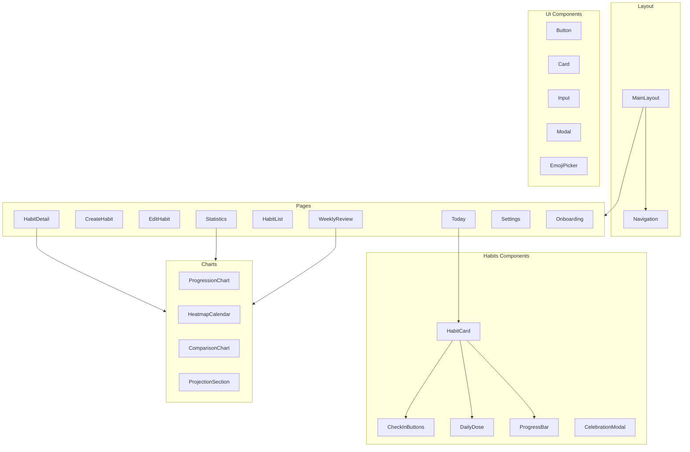

---

## Calcul de progression

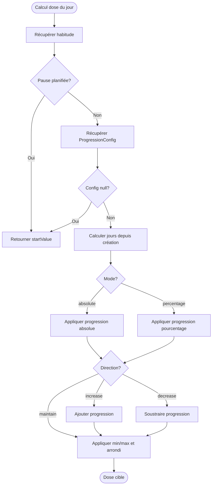

---

## Gestion des notifications

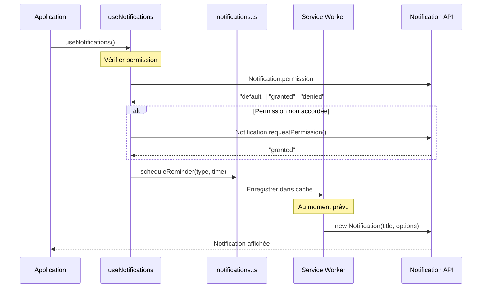

---

## Stockage des données

### Structure localStorage

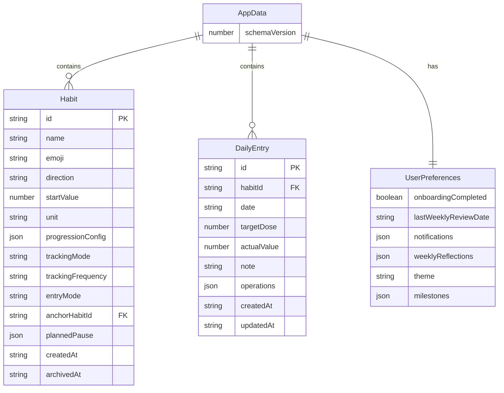

### Clé localStorage

```
localStorage.getItem('doucement-data')
```

### Format de date

Toutes les dates utilisent le format **YYYY-MM-DD** (ISO 8601 simplifié).

---

## Migration de données

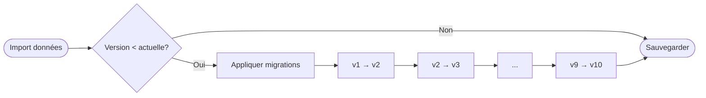

Chaque migration est **idempotente** et **réversible** en théorie.

---

## PWA & Service Worker

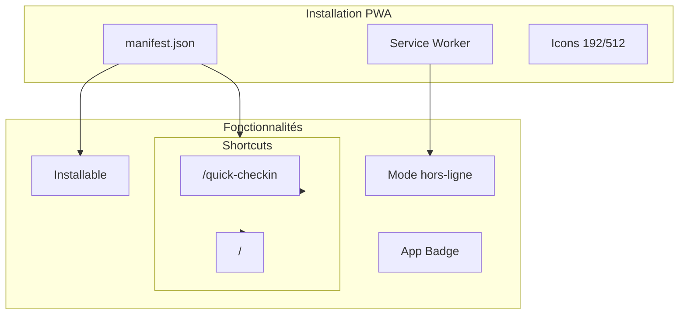

---

## Technologies

| Catégorie | Technologie | Usage |
|-----------|-------------|-------|
| Framework | React 18 | UI Components |
| Build | Vite | Bundling, HMR |
| Routing | React Router | Navigation SPA |
| Charts | Recharts | Graphiques |
| i18n | i18next | Internationalisation |
| Tests unitaires | Vitest | Services, Hooks |
| Tests E2E | Playwright | Parcours utilisateur |

---

## Références

- PRD : [prd.md](prd.md)
- Types : [src/types/index.ts](../src/types/index.ts)
- Glossaire : [GLOSSARY.md](GLOSSARY.md)
- Design System : [design/design-system-specification.md](design/design-system-specification.md)
