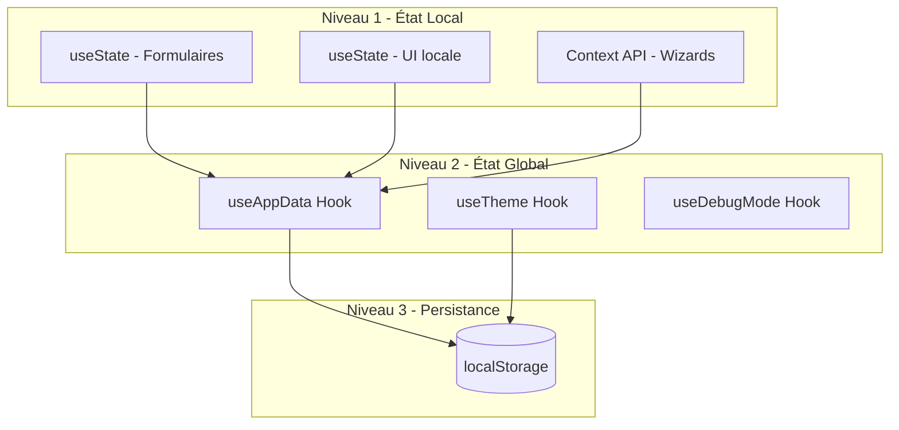
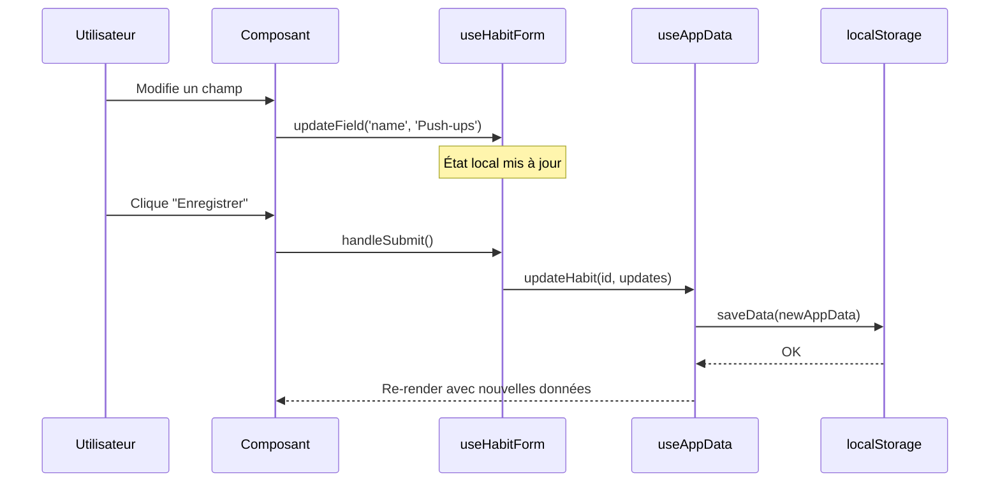
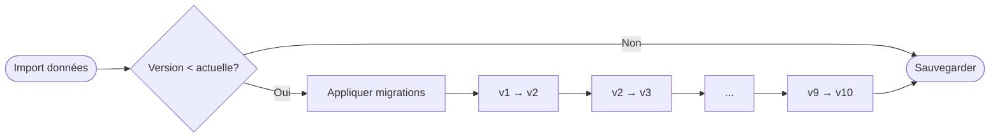

# Architecture - Doucement

Ce document décrit l'architecture technique de Doucement avec des diagrammes Mermaid.

---

## Vue d'ensemble

Doucement est une **SPA 100% statique** (Single Page Application) sans backend. Toutes les données sont stockées localement dans le navigateur.


---

## Flux de données

### Lecture des données


### Écriture des données


---

## Cycle de vie d'une habitude


---

## Structure des services


### Responsabilités des services

| Service | Responsabilité |
|---------|----------------|
| `storage.ts` | Lecture/écriture localStorage |
| `progression.ts` | Calcul de la dose cible |
| `statistics.ts` | Calculs statistiques (taux, moyennes, patterns) |
| `migration.ts` | Migration des données entre versions de schéma |
| `notifications.ts` | Gestion des notifications Web |
| `milestones.ts` | Détection et célébration des jalons |
| `validation.ts` | Validation des données importées |
| `importExport.ts` | Import/export de données JSON |
| `imageExport.ts` | Export PNG (cartes partageables) |
| `exportPdf.ts` | Export PDF (rapports) |

---

## Gestion d'état 3-tier

L'application utilise une architecture de gestion d'état à 3 niveaux, sans bibliothèque externe comme Redux ou Zustand. Cette approche a été choisie pour sa simplicité et son adéquation avec une application 100% locale.



### Les 3 niveaux

| Niveau | Mécanisme | Usage | Exemple |
|--------|-----------|-------|---------|
| **Local** | `useState` | État temporaire d'un composant | Champ de formulaire en cours d'édition |
| **Partagé** | Custom Hooks | État partagé entre composants | `useAppData`, `useHabitForm` |
| **Persistant** | localStorage | Données permanentes | Habitudes, entrées, préférences |

### Quand utiliser chaque niveau

**Niveau 1 - État local (`useState`)**
- Valeurs de formulaire en cours de saisie
- État d'ouverture d'un modal
- Animation en cours
- Tout état qui ne survit pas à un refresh

**Niveau 2 - Hooks partagés**
- État dérivé de plusieurs sources (`useHabitForm`)
- Logique réutilisable entre composants
- État global sans persistance (`useCelebrations`)

**Niveau 3 - Persistance (localStorage)**
- Données utilisateur (habitudes, entrées)
- Préférences (thème, notifications)
- Tout ce qui doit survivre à la fermeture du navigateur

### Flux de données typique



### Justification de ce choix

**Pourquoi pas Redux/Zustand ?**
1. **Simplicité** : L'app n'a pas de flux de données complexes
2. **Performance** : Pas de re-renders inutiles avec les custom hooks
3. **Taille du bundle** : Aucune dépendance supplémentaire
4. **Testabilité** : Les hooks sont facilement mockables

**Avantages**
- Pas de boilerplate (actions, reducers)
- TypeScript natif sans configuration
- Courbe d'apprentissage minimale
- Debug facilité (données visibles dans localStorage)

---

## Patterns de hooks

Les hooks personnalisés suivent des conventions spécifiques pour maintenir la cohérence du codebase.

### Conventions de nommage

| Pattern | Description | Exemple |
|---------|-------------|---------|
| `use<Nom>` | Hook standard React | `useAppData`, `useTheme` |
| `use<Entity>Form` | Gestion de formulaire | `useHabitForm` |
| `use<Feature>Context` | Consumer de Context | `useEditHabitContext` |

### Hooks principaux

**`useAppData`** - Accès aux données de l'application
```typescript
const {
  habits,
  addHabit,
  updateHabit,
  deleteHabit,
  entries,
  addEntry,
  isLoading
} = useAppData()
```
- Source de vérité pour toutes les données
- Gère la synchronisation avec localStorage
- Fournit des méthodes CRUD pour habitudes et entrées

**`useHabitForm`** - Gestion des formulaires d'habitude
```typescript
const {
  form,
  updateField,
  isValid,
  hasChanges,
  errors
} = useHabitForm({ mode: 'edit', initialHabit })
```
- Partagé entre CreateHabit et EditHabit
- Gère la validation et la détection de changements
- Mode 'create' ou 'edit'

**`useCelebrations`** - Gestion des célébrations
```typescript
const {
  checkMilestones,
  celebrationData,
  dismissCelebration
} = useCelebrations()
```
- Détecte les jalons atteints
- Gère l'affichage des modals de célébration

**`useTheme`** - Gestion du thème
```typescript
const { theme, setTheme, isDark } = useTheme()
```
- Synchronise avec les préférences système
- Persiste le choix utilisateur

### Structure d'un hook

```typescript
// src/hooks/useExample.ts

interface UseExampleOptions {
  // Options du hook
}

interface UseExampleReturn {
  // Valeurs retournées
}

export function useExample(options: UseExampleOptions): UseExampleReturn {
  // État local
  const [state, setState] = useState()

  // Effets
  useEffect(() => {}, [])

  // Callbacks mémorisés
  const handleAction = useCallback(() => {}, [])

  // Valeurs calculées
  const derived = useMemo(() => {}, [])

  return { state, handleAction, derived }
}
```

### Bonnes pratiques

1. **Typer les options et le retour** : Utiliser des interfaces explicites
2. **Mémoiser les callbacks** : Utiliser `useCallback` pour éviter les re-renders
3. **Documenter avec JSDoc** : Expliquer le but et l'usage
4. **Tester unitairement** : Chaque hook doit avoir ses tests

---

## Structure des composants


---

## Calcul de progression


---

## Gestion des notifications


---

## Stockage des données

### Structure localStorage


### Clé localStorage

```
localStorage.getItem('doucement-data')
```

### Format de date

Toutes les dates utilisent le format **YYYY-MM-DD** (ISO 8601 simplifié).

---

## Migration de données



Chaque migration est **idempotente** et **réversible** en théorie.

---

## PWA & Service Worker


---

## Technologies

| Catégorie | Technologie | Usage |
|-----------|-------------|-------|
| Framework | React 18 | UI Components |
| Build | Vite | Bundling, HMR |
| Routing | React Router | Navigation SPA |
| Charts | Recharts | Graphiques |
| i18n | i18next | Internationalisation |
| Tests unitaires | Vitest | Services, Hooks |
| Tests E2E | Playwright | Parcours utilisateur |

---

## Références

- PRD : [prd.md](prd.md)
- Types : [src/types/index.ts](../src/types/index.ts)
- Glossaire : [GLOSSARY.md](GLOSSARY.md)
- Design System : [design/design-system-specification.md](design/design-system-specification.md)
